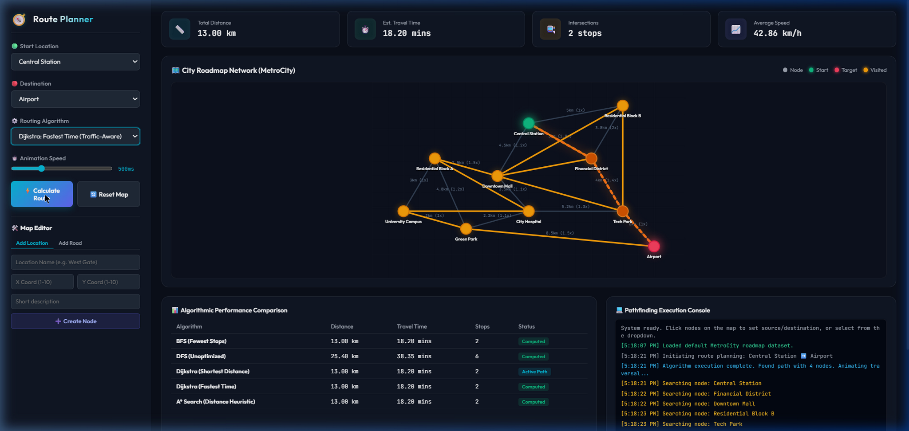

# 🧭 Intelligent Route Planner Using Graph Algorithms

[](https://www.python.org/)
[]()
[]()
[]()

An industry-oriented **Data Structures & Algorithms (DSA)** project that simulates modern navigation systems such as Google Maps, Uber, Ola, Swiggy, and logistics platforms using Graph Algorithms.

The system models a city as a weighted graph and calculates optimized routes using **BFS, DFS, Dijkstra's Algorithm, and A* Search Algorithm**.

---

# 📌 Project Overview

Route optimization is one of the most important real-world applications of Graph Theory.

This project demonstrates how navigation systems represent locations as graph nodes and roads as weighted edges to determine the most efficient route between two locations.

The application supports:

* Shortest Distance Routing
* Fastest Route Calculation
* Traffic-Aware Optimization
* Route Visualization
* Graph Traversal Analysis

---

# 🎯 Problem Statement

Given a source and destination:

* Model the city as a weighted graph
* Represent roads as edges
* Apply graph algorithms
* Find the optimal route
* Calculate travel distance and estimated travel time
* Visualize the route network

---

# 🌍 Real-World Applications

### Navigation Systems

* Google Maps
* Apple Maps
* Waze

### Ride Sharing Platforms

* Uber
* Ola
* Lyft

### Food Delivery Platforms

* Swiggy
* Zomato
* DoorDash

### Logistics & Transportation

* DHL
* FedEx
* UPS

### Smart City Transportation

* Fleet Management
* Emergency Response Routing
* Traffic Monitoring Systems

---

# ✨ Features

✅ Graph-Based City Modeling

✅ Adjacency List Representation

✅ Breadth First Search (BFS)

✅ Depth First Search (DFS)

✅ Dijkstra's Shortest Path Algorithm

✅ A* Search Algorithm

✅ Traffic-Aware Route Optimization

✅ Distance & Time Calculation

✅ Route Reconstruction

✅ Interactive CLI Interface

✅ Route Performance Comparison

✅ Graph Visualization Using NetworkX

✅ Professional Project Documentation

---

# 🛠️ Tech Stack

| Category        | Technology             |
| --------------- | ---------------------- |
| Language        | Python 3.8+            |
| Data Structures | Graph, Adjacency List  |
| Algorithms      | BFS, DFS, Dijkstra, A* |
| Priority Queue  | heapq                  |
| Visualization   | NetworkX, Matplotlib   |
| Data Storage    | JSON                   |
| Version Control | Git & GitHub           |

---

# 🏗️ System Architecture

```text
User Input
     │
     ▼
Source & Destination
     │
     ▼
Graph Creation
     │
     ▼
Adjacency List
     │
     ▼
Pathfinding Algorithms
(BFS / DFS / Dijkstra / A*)
     │
     ▼
Optimized Route
     │
     ▼
Route Summary
     │
     ▼
Graph Visualization
```

---

# 🧠 DSA Concepts Used

## Graph

Locations are represented as nodes and roads as weighted edges.

## Adjacency List

Efficient graph representation with O(V + E) space complexity.

## BFS

Used to explore nodes level by level.

### Time Complexity

O(V + E)

## DFS

Used for graph traversal and exploration.

### Time Complexity

O(V + E)

## Dijkstra's Algorithm

Finds shortest path in weighted graphs.

### Time Complexity

O((V + E) log V)

## A* Search

Heuristic-based shortest path algorithm.

### Time Complexity

O(E)

## Min Heap

Used for efficient priority queue operations.

---

# 📂 Project Structure

```text
Intelligent-Route-Planner-Graph-Algorithms/
│
├── data/
│   └── city_map.json
│
├── src/
│   ├── graph.py
│   ├── algorithms.py
│   └── visualization.py
│
├── outputs/
│   └── route_reports/
│
├── images/
│   ├── dashboard_screenshot.png
│   ├── dashboard_demo.webp
│   └── route_graph.png
│
├── web/
│   ├── index.html
│   ├── styles.css
│   └── app.js
│
├── docs/
│   └── architecture.md
│
├── requirements.txt
├── README.md
├── .gitignore
├── run_simulation.py
└── main.py
```

---

# ⚙️ Installation

## Clone Repository

```bash
git clone https://github.com/your-username/Intelligent-Route-Planner-Graph-Algorithms.git

cd Intelligent-Route-Planner-Graph-Algorithms
```

## Install Dependencies

```bash
pip install -r requirements.txt
```

---

# ▶️ Running the Project

## Interactive CLI

```bash
python main.py
```

## Automated Simulation

```bash
python run_simulation.py
```

## Interactive Dashboard

```bash
python -m http.server 8000
```

Open Browser:

```text
http://localhost:8000/web/
```

---

# 📊 Sample Output

```text
SOURCE: Central Station

DESTINATION: Airport

ALGORITHM: Dijkstra Distance

ROUTE:

Central Station
    ↓
Financial District
    ↓
Tech Park
    ↓
Airport

TOTAL DISTANCE: 13.00 km

ESTIMATED TIME: 18.20 min
```

---

# 📈 Algorithm Performance Comparison

| Metric      | DFS       | Dijkstra  |
| ----------- | --------- | --------- |
| Distance    | 25.40 km  | 13.00 km  |
| Travel Time | 38.35 min | 18.20 min |
| Stops       | 6         | 2         |

### Improvements

✔ 48.8% reduction in travel distance

✔ 52.5% reduction in travel time

✔ More efficient route planning

---

# 📸 Screenshots

## Dashboard



## Route Visualization


## Route Animation


---

# 🚀 Future Enhancements

* Real-Time Traffic Integration
* Google Maps API Integration
* Live GPS Tracking
* Multiple Destination Routing
* Vehicle Routing Problem (VRP)
* AI-Based Traffic Prediction
* Dynamic Route Replanning

---

# 🎓 Learning Outcomes

Through this project, I gained practical experience with:

* Graph Data Structures
* Adjacency Lists
* BFS & DFS Traversal
* Dijkstra's Algorithm
* A* Search Algorithm
* Min Heap Optimization
* Route Optimization Techniques
* Data Visualization
* Software Engineering Practices
* Git & GitHub Workflow

---

# 💼 Interview Questions Covered

* Explain Graph Data Structures.
* Why did you choose Adjacency Lists?
* Explain Dijkstra's Algorithm.
* Difference between BFS and DFS.
* What is a Min Heap?
* Why is Dijkstra suitable for route planning?
* How would you improve this system?
* Explain the time complexity of your algorithms.
* What challenges did you face during development?
* Explain your project end-to-end.

---

# 👨‍💻 Author

**Sarthak Dhumal**

Computer Engineering Student

Interests:

* Data Structures & Algorithms
* Software Development
* Backend Engineering
* System Design
* Problem Solving

---

# ⭐ If You Like This Project

Give this repository a ⭐ Star and share it with others.

---

